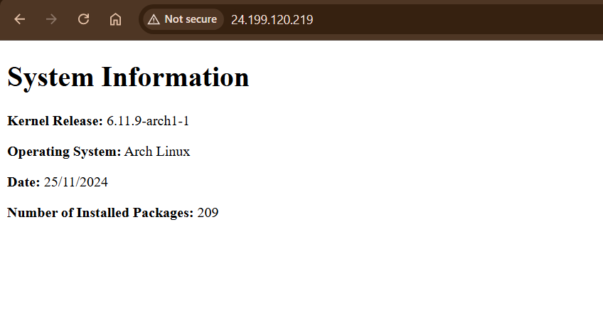

# Assignment 3 Part 1

## Introduction
This repository contains the necessary files and instructions to "setup a Bash script that generates a static index.html file that contains some system information. The script will be configured to run automatically every day at 05:00 using a systemd service and timer. The HTML document created by this script will be served with an nginx web server that will run on your Arch Linux droplet along with a firewall setup using ufw to help secure your server." [1]
### Creating the System User

The first step in this process is creating a system user named Webgen. We want to create this system user, as A system user isolates processes or services from other users and from the root account, reducing security risks and prevents direct access to the system by this user, further increasing security. To create a system user `webgen` with a home directory at `/var/lib/webgen`, a non-login shell, and ownership of its directory and files:

1. create the system user with a non-login shell and home directory 
```bash 
sudo useradd -r -d /var/lib/webgen -s /usr/sbin/nologin webgen
```

-r: creates the system user
-d /var/lib/webgen: specifies the location of the home directory for the new user Webgen
-s /urs/sbin/nologin: specifies the no-login shell to prevent directly logging in with the Webgen user's credentials.

2. Create the home directory for the new user
```bash
sudo mkdir -p /var/lib/webgen  
```

3. Set ownership of the home directory to the user (and subsequent group)
``` 
sudo chown -R webgen:webgen /var/lib/webgen
```

-R: recursively sets the ownership of the file within the specified location to the same ownership as the chown command specifies.
## Creating directories + Moving Necessary Files
Assuming you have already downloaded all the files from this repository, we must now create the file/directory organizational system within the home directory for the script and unit files to work properly:

1. Create necessary directories
```bash
mkdir /var/lib/webgen/bin
mkdir /var/lib/webgen/HTML
```

2. Move `generate_index` script into `bin` folder
```bash
mv generate_index /var/lib/webgen/bin
```

3. Give ownership of subsequent file/directory organizational system to Webgen user and group
```bash
sudo chown -R webgen:webgen /var/lib/webgen
```

4. Change the permissions of the generate_index script to be executable for the user
```bash
sudo chmod u+a /var/lib/webgen/bin/generate_index
```

5. Move `generate_index.service` and `generate_index.timer` to /etc/systemd/system
```bash
mv generate_index.service /etc/systemd/system
mv generage_index.timer/etc/systemd/system
```

## Enabling + Testing the `.service` and `.timer` files
Now that all the files are in their proper locations, we must enable and test the service and timer files to ensure that they are functioning as expected:

1. Reload Systemd configuration files
```bash
sudo systemctl daemon-reload
```

2. Enable/start both service and timer files
```bash
sudo systemctl enable generate_index.service
sudo systemctl enable generate_index.timer
```

3. Check whether the files are running properly
```bash
sudo systemctl status generate_index.service
systemctl list-timers --all | grep generate_index.timer
```

>[!Note] 
> If necessary, use:
> `sudo journalctl -u generate_index.service`
> `sudo journalctl -u generate_index.timer`
> To view the logs of each configuration file.

## nginx configuration for webgen
To be able to access the information in the index.html file created by the generate_index script from our web browser, we must set up nginx and create a new server based off of our DigitalOcean droplet:

1. Make folders as locations for our server files[2]
```bash
mkdir /etc/nginx/sites-available #where the server file is going to go
mkdir /etc/nginx/sites-enabled #the system that nginx uses to moderate which sites will be enabled/available
```

2. Move server block file into the sites -available directory 
```bash
sudo mv webgen.conf /etc/nginx/sites-available
```

3. Create symbolic link from the file to the `/etc/nginx/sites-enabled` directory (to enable the server block) [2]
```bash
ln -s /etc/nginx/sites-available/webgen.conf /etc/nginx/sites-enabled/webgen.conf
```

4. Edit the nginx.conf file to have the user be Webgen
```bash
sudo nvim /etc/nginx/nginx.conf
#Inside of the nginx.conf file, look for user _______; and change it to user webgen;
```

>[!Note] 
>The `nginx.conf` file may look different than the file provided in the repository; this is just a simplified version that removed content  unnecessary for the purpose of this assignment.[3]

5. Reload systemd configuration files/Start and enable nginx
```bash
sudo systemctl daemon-reload
sudo systemctl start nginx
sudo systemctl enable nginx
```

6. Check for errors with nginx and the status of the nginx service with systemctl
```bash
sudo nginx -t
sudo systemctl stats nginx
```

## `ufw`  Setup [4]
The final step in our process is to set up `ufw`:

1. Allow SSH and http in the firewall (to be able to access from anywhere)
```bash
sudo ufw allow ssh
sudo ufw allow http
```

2. Limit ssh connection
```bash
sudo ufw limit ssh
```

3.  Enable ufw
```bash
sudo systemctl enable --now ufw.service
```

>[!Note]
>To check the status of the firewall and confirm whether it is enabled and working as expected, run
>`sudo ufw status verbose`
>If working as expected, you will see an output that resembles the following image:
>

## Final Result
To access the contents of index.html from a browser, navigate to your preferred browser and enter the ip address of your server (droplet) into the url field. You should see a result that resembles the following image:


## References
[1] McNinch, Nathan. https://learn.bcit.ca/content/enforced/1063362-45842.202430/assignment3p1.pdf
[2] Nginx Arch Wiki page. https://wiki.archlinux.org/title/Nginx
[3] Nginx beginner's guide. https://nginx.org/en/docs/beginners_guide.html
[4] Arch Documentation on ufw. https://wiki.archlinux.org/title/Uncomplicated_Firewall
